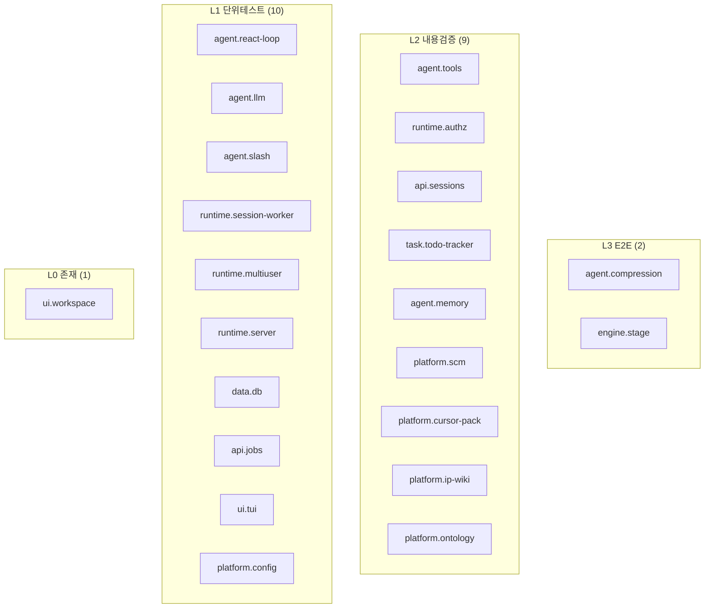

# Platform Ontology Graph

`ontology/platform_*.yaml` 실데이터에서 자동 생성. 손으로 고치지 말 것.

```mermaid
flowchart LR
  classDef closed fill:#d4edda,stroke:#28a745,color:#155724
  classDef refuted fill:#f8d7da,stroke:#dc3545,color:#721c24
  classDef stale fill:#fff3cd,stroke:#ffc107,color:#856404
  classDef open fill:#e2e3e5,stroke:#6c757d,color:#383d41
  classDef unit fill:#cce5ff,stroke:#004085,color:#004085
  classDef req fill:#ffffff,stroke:#333,color:#111
  classDef ev fill:#f8f9fa,stroke:#adb5bd,color:#495057
  subgraph SG_REQ_PLAT_TENANT_ISOLATION_001["REQ_PLAT_TENANT_ISOLATION_001"]
    REQ_PLAT_TENANT_ISOLATION_001["한 사용자는 다른 사용자의 세션/파일/이력을 읽거나 쓸 수 없다 (fail-clos…"]:::req
    OBL_SESS_READ_CROSS_USER_404["✅ OBL_SESS_READ_CROSS_USER_404<br/>(behavior)"]:::closed
    REQ_PLAT_TENANT_ISOLATION_001 --> OBL_SESS_READ_CROSS_USER_404
    OBL_SESS_WRITE_CROSS_USER_404["✅ OBL_SESS_WRITE_CROSS_USER_404<br/>(behavior)"]:::closed
    REQ_PLAT_TENANT_ISOLATION_001 --> OBL_SESS_WRITE_CROSS_USER_404
    OBL_SESS_HISTORY_STATE_CROSS_USER_DENIED["✅ OBL_SESS_HISTORY_STATE_CROSS_USER_DENIED<br/>(behavior)"]:::closed
    REQ_PLAT_TENANT_ISOLATION_001 --> OBL_SESS_HISTORY_STATE_CROSS_USER_DENIED
    OBL_FS_AUTHZ_FAIL_CLOSED["✅ OBL_FS_AUTHZ_FAIL_CLOSED<br/>(behavior)"]:::closed
    REQ_PLAT_TENANT_ISOLATION_001 --> OBL_FS_AUTHZ_FAIL_CLOSED
    OBL_PATH_TRAVERSAL_DENIED["✅ OBL_PATH_TRAVERSAL_DENIED<br/>(behavior)"]:::closed
    REQ_PLAT_TENANT_ISOLATION_001 --> OBL_PATH_TRAVERSAL_DENIED
    OBL_SESS_AUTHORIZE_NO_FAIL_OPEN["❌ OBL_SESS_AUTHORIZE_NO_FAIL_OPEN<br/>(concurrent)"]:::refuted
    REQ_PLAT_TENANT_ISOLATION_001 --> OBL_SESS_AUTHORIZE_NO_FAIL_OPEN
    OBL_ACTIVATE_ENV_NO_CROSS_LEAK["❌ OBL_ACTIVATE_ENV_NO_CROSS_LEAK<br/>(behavior)"]:::refuted
    REQ_PLAT_TENANT_ISOLATION_001 --> OBL_ACTIVATE_ENV_NO_CROSS_LEAK
    OBL_GIT_REST_CROSS_TENANT_GATED["⚠ OBL_GIT_REST_CROSS_TENANT_GATED<br/>(behavior)"]:::stale
    REQ_PLAT_TENANT_ISOLATION_001 --> OBL_GIT_REST_CROSS_TENANT_GATED
    OBL_IP_REPORTS_CROSS_TENANT_GATED["⚠ OBL_IP_REPORTS_CROSS_TENANT_GATED<br/>(behavior)"]:::stale
    REQ_PLAT_TENANT_ISOLATION_001 --> OBL_IP_REPORTS_CROSS_TENANT_GATED
    OBL_WORKSPACE_DOWNLOAD_GATED["⚠ OBL_WORKSPACE_DOWNLOAD_GATED<br/>(behavior)"]:::stale
    REQ_PLAT_TENANT_ISOLATION_001 --> OBL_WORKSPACE_DOWNLOAD_GATED
    OBL_SETTINGS_ADMIN_ONLY_MULTIUSER["⚠ OBL_SETTINGS_ADMIN_ONLY_MULTIUSER<br/>(behavior)"]:::stale
    REQ_PLAT_TENANT_ISOLATION_001 --> OBL_SETTINGS_ADMIN_ONLY_MULTIUSER
    OBL_GIT_ANON_READ_DEFAULT_OFF_MULTIUSER["⚠ OBL_GIT_ANON_READ_DEFAULT_OFF_MULTIUSER<br/>(behavior)"]:::stale
    REQ_PLAT_TENANT_ISOLATION_001 --> OBL_GIT_ANON_READ_DEFAULT_OFF_MULTIUSER
    OBL_SCM_JSON_API_CROSS_TENANT_GATED["○ OBL_SCM_JSON_API_CROSS_TENANT_GATED<br/>(behavior)"]:::open
    REQ_PLAT_TENANT_ISOLATION_001 --> OBL_SCM_JSON_API_CROSS_TENANT_GATED
    OBL_CONVERSATION_SSOT_IMPORT_OWNER_SCOPED["○ OBL_CONVERSATION_SSOT_IMPORT_OWNER_SCOPED<br/>(behavior)"]:::open
    REQ_PLAT_TENANT_ISOLATION_001 --> OBL_CONVERSATION_SSOT_IMPORT_OWNER_SCOPED
  end
  subgraph SG_REQ_PLAT_MEMORY_DURABILITY_001["REQ_PLAT_MEMORY_DURABILITY_001"]
    REQ_PLAT_MEMORY_DURABILITY_001["에이전트 메모리는 재시작·파손에도 보존/복구되고 사용자별로 격리된다…"]:::req
    OBL_MEM_PREF_PERSIST_RELOAD["✅ OBL_MEM_PREF_PERSIST_RELOAD<br/>(content)"]:::closed
    REQ_PLAT_MEMORY_DURABILITY_001 --> OBL_MEM_PREF_PERSIST_RELOAD
    OBL_MEM_CORRUPT_STORE_RECOVERY["✅ OBL_MEM_CORRUPT_STORE_RECOVERY<br/>(behavior)"]:::closed
    REQ_PLAT_MEMORY_DURABILITY_001 --> OBL_MEM_CORRUPT_STORE_RECOVERY
    OBL_MEM_USER_ISOLATION["✅ OBL_MEM_USER_ISOLATION<br/>(content)"]:::closed
    REQ_PLAT_MEMORY_DURABILITY_001 --> OBL_MEM_USER_ISOLATION
    OBL_MEM_EXPORT_IMPORT_ROUNDTRIP["✅ OBL_MEM_EXPORT_IMPORT_ROUNDTRIP<br/>(content)"]:::closed
    REQ_PLAT_MEMORY_DURABILITY_001 --> OBL_MEM_EXPORT_IMPORT_ROUNDTRIP
    OBL_MEM_ABS_PATH_RESPECTED["❌ OBL_MEM_ABS_PATH_RESPECTED<br/>(structural)"]:::refuted
    REQ_PLAT_MEMORY_DURABILITY_001 --> OBL_MEM_ABS_PATH_RESPECTED
  end
  subgraph SG_REQ_PLAT_LLM_FAILURE_VISIBILITY_001["REQ_PLAT_LLM_FAILURE_VISIBILITY_001"]
    REQ_PLAT_LLM_FAILURE_VISIBILITY_001["LLM 호출 실패는 절대 정상 결과로 둔갑하지 않는다 (green-while-bro…"]:::req
    OBL_MEM_EXTRACT_LLM_FAIL_DISTINGUISHABLE["❌ OBL_MEM_EXTRACT_LLM_FAIL_DISTINGUISHABLE<br/>(behavior)"]:::refuted
    REQ_PLAT_LLM_FAILURE_VISIBILITY_001 --> OBL_MEM_EXTRACT_LLM_FAIL_DISTINGUISHABLE
    OBL_COMPRESS_LLM_FAIL_SURFACED["❌ OBL_COMPRESS_LLM_FAIL_SURFACED<br/>(behavior)"]:::refuted
    REQ_PLAT_LLM_FAILURE_VISIBILITY_001 --> OBL_COMPRESS_LLM_FAIL_SURFACED
  end
  subgraph SG_REQ_PLAT_DEV_TRACEABILITY_001["REQ_PLAT_DEV_TRACEABILITY_001"]
    REQ_PLAT_DEV_TRACEABILITY_001["플랫폼의 모든 개발 약속은 기계 추적 가능하다 (선언→증거→판정)…"]:::req
    OBL_ONTOLOGY_DECLARED_PATHS_REAL["✅ OBL_ONTOLOGY_DECLARED_PATHS_REAL<br/>(structural)"]:::closed
    REQ_PLAT_DEV_TRACEABILITY_001 --> OBL_ONTOLOGY_DECLARED_PATHS_REAL
    OBL_NEW_MODULE_REGISTERED["✅ OBL_NEW_MODULE_REGISTERED<br/>(structural)"]:::closed
    REQ_PLAT_DEV_TRACEABILITY_001 --> OBL_NEW_MODULE_REGISTERED
    OBL_SPINE_INTEGRITY_ENFORCED["✅ OBL_SPINE_INTEGRITY_ENFORCED<br/>(structural)"]:::closed
    REQ_PLAT_DEV_TRACEABILITY_001 --> OBL_SPINE_INTEGRITY_ENFORCED
  end
  subgraph SG_REQ_PLAT_SCM_PERFORCE_SYNC_001["REQ_PLAT_SCM_PERFORCE_SYNC_001"]
    REQ_PLAT_SCM_PERFORCE_SYNC_001["Perforce Sync 탭의 checkout→edit→submit은 기존 depo…"]:::req
    OBL_P4_CHECKOUT_OPENS_EXISTING_AS_EDIT["⚠ OBL_P4_CHECKOUT_OPENS_EXISTING_AS_EDIT<br/>(behavior)"]:::stale
    REQ_PLAT_SCM_PERFORCE_SYNC_001 --> OBL_P4_CHECKOUT_OPENS_EXISTING_AS_EDIT
    OBL_P4_EDIT_FAILURE_NOT_SOFTENED["⚠ OBL_P4_EDIT_FAILURE_NOT_SOFTENED<br/>(behavior)"]:::stale
    REQ_PLAT_SCM_PERFORCE_SYNC_001 --> OBL_P4_EDIT_FAILURE_NOT_SOFTENED
    OBL_P4_SUBMIT_FAIL_NO_STRANDED_CL["⚠ OBL_P4_SUBMIT_FAIL_NO_STRANDED_CL<br/>(behavior)"]:::stale
    REQ_PLAT_SCM_PERFORCE_SYNC_001 --> OBL_P4_SUBMIT_FAIL_NO_STRANDED_CL
    OBL_P4_STREAM_ROOT_TARGET_MAPS_IP["⚠ OBL_P4_STREAM_ROOT_TARGET_MAPS_IP<br/>(behavior)"]:::stale
    REQ_PLAT_SCM_PERFORCE_SYNC_001 --> OBL_P4_STREAM_ROOT_TARGET_MAPS_IP
    OBL_P4_PENDING_CL_DELETABLE["⚠ OBL_P4_PENDING_CL_DELETABLE<br/>(behavior)"]:::stale
    REQ_PLAT_SCM_PERFORCE_SYNC_001 --> OBL_P4_PENDING_CL_DELETABLE
  end
  subgraph SG_REQ_PLAT_CURSOR_PARITY_001["REQ_PLAT_CURSOR_PARITY_001"]
    REQ_PLAT_CURSOR_PARITY_001["Cursor 에이전트는 .cursor 팩(rule/hook/subagent/skil…"]:::req
    OBL_CURSOR_TODO_LOOP_HOOK["✅ OBL_CURSOR_TODO_LOOP_HOOK<br/>(behavior)"]:::closed
    REQ_PLAT_CURSOR_PARITY_001 --> OBL_CURSOR_TODO_LOOP_HOOK
    OBL_CURSOR_PACK_REFERENTIAL_INTEGRITY["✅ OBL_CURSOR_PACK_REFERENTIAL_INTEGRITY<br/>(structural)"]:::closed
    REQ_PLAT_CURSOR_PARITY_001 --> OBL_CURSOR_PACK_REFERENTIAL_INTEGRITY
    OBL_CURSOR_ROCEV_CHAIN_SKILL["✅ OBL_CURSOR_ROCEV_CHAIN_SKILL<br/>(structural)"]:::closed
    REQ_PLAT_CURSOR_PARITY_001 --> OBL_CURSOR_ROCEV_CHAIN_SKILL
    OBL_IP_WIKI_HELPER["✅ OBL_IP_WIKI_HELPER<br/>(behavior)"]:::closed
    REQ_PLAT_CURSOR_PARITY_001 --> OBL_IP_WIKI_HELPER
    OBL_IP_WIKI_CHECK_KILLPROOF["✅ OBL_IP_WIKI_CHECK_KILLPROOF<br/>(behavior)"]:::closed
    REQ_PLAT_CURSOR_PARITY_001 --> OBL_IP_WIKI_CHECK_KILLPROOF
    OBL_ATLAS_MCP_SERVER["✅ OBL_ATLAS_MCP_SERVER<br/>(behavior)"]:::closed
    REQ_PLAT_CURSOR_PARITY_001 --> OBL_ATLAS_MCP_SERVER
    OBL_CURSOR_SUBAGENT_EVIDENCE_HOOK["✅ OBL_CURSOR_SUBAGENT_EVIDENCE_HOOK<br/>(behavior)"]:::closed
    REQ_PLAT_CURSOR_PARITY_001 --> OBL_CURSOR_SUBAGENT_EVIDENCE_HOOK
    OBL_CURSOR_PACK_SELF_CONTAINED["✅ OBL_CURSOR_PACK_SELF_CONTAINED<br/>(behavior)"]:::closed
    REQ_PLAT_CURSOR_PARITY_001 --> OBL_CURSOR_PACK_SELF_CONTAINED
    OBL_CURSOR_VENDOR_NO_DRIFT["✅ OBL_CURSOR_VENDOR_NO_DRIFT<br/>(structural)"]:::closed
    REQ_PLAT_CURSOR_PARITY_001 --> OBL_CURSOR_VENDOR_NO_DRIFT
    OBL_CURSOR_AGENT_FULL_COVERAGE["✅ OBL_CURSOR_AGENT_FULL_COVERAGE<br/>(structural)"]:::closed
    REQ_PLAT_CURSOR_PARITY_001 --> OBL_CURSOR_AGENT_FULL_COVERAGE
  end
  subgraph SG_REQ_PLAT_ORCH_CHAT_UX_001["REQ_PLAT_ORCH_CHAT_UX_001"]
    REQ_PLAT_ORCH_CHAT_UX_001["Orchestrator chat 패널은 백엔드가 산출한 모든 출력(유저 메시지/ac…"]:::req
    OBL_ORCH_CHAT_OUTPUT_VISIBLE["✅ OBL_ORCH_CHAT_OUTPUT_VISIBLE<br/>(behavior)"]:::closed
    REQ_PLAT_ORCH_CHAT_UX_001 --> OBL_ORCH_CHAT_OUTPUT_VISIBLE
  end
  U_agent_compression["agent.compression<br/>L3 E2E"]:::unit
  U_agent_memory["agent.memory<br/>L2 내용검증"]:::unit
  U_api_sessions["api.sessions<br/>L2 내용검증"]:::unit
  U_platform_cursor_pack["platform.cursor-pack<br/>L2 내용검증"]:::unit
  U_platform_ip_wiki["platform.ip-wiki<br/>L2 내용검증"]:::unit
  U_platform_ontology["platform.ontology<br/>L2 내용검증"]:::unit
  U_platform_scm["platform.scm<br/>L2 내용검증"]:::unit
  U_runtime_authz["runtime.authz<br/>L2 내용검증"]:::unit
  U_ui_workspace["ui.workspace<br/>L0 존재"]:::unit
  OBL_SESS_READ_CROSS_USER_404 --> U_api_sessions
  OBL_SESS_READ_CROSS_USER_404 -.-> E_0
  OBL_SESS_WRITE_CROSS_USER_404 --> U_api_sessions
  OBL_SESS_WRITE_CROSS_USER_404 -.-> E_0
  OBL_SESS_WRITE_CROSS_USER_404 -.-> E_0
  OBL_SESS_HISTORY_STATE_CROSS_USER_DENIED --> U_api_sessions
  OBL_SESS_HISTORY_STATE_CROSS_USER_DENIED -.-> E_0
  OBL_SESS_HISTORY_STATE_CROSS_USER_DENIED -.-> E_0
  OBL_FS_AUTHZ_FAIL_CLOSED --> U_runtime_authz
  OBL_FS_AUTHZ_FAIL_CLOSED -.-> E_1
  OBL_FS_AUTHZ_FAIL_CLOSED -.-> E_1
  OBL_PATH_TRAVERSAL_DENIED --> U_runtime_authz
  OBL_PATH_TRAVERSAL_DENIED -.-> E_1
  OBL_PATH_TRAVERSAL_DENIED -.-> E_0
  OBL_SESS_AUTHORIZE_NO_FAIL_OPEN --> U_api_sessions
  OBL_ACTIVATE_ENV_NO_CROSS_LEAK --> U_api_sessions
  OBL_GIT_REST_CROSS_TENANT_GATED --> U_runtime_authz
  OBL_GIT_REST_CROSS_TENANT_GATED -.-> E_2
  OBL_IP_REPORTS_CROSS_TENANT_GATED --> U_runtime_authz
  OBL_IP_REPORTS_CROSS_TENANT_GATED -.-> E_2
  OBL_WORKSPACE_DOWNLOAD_GATED --> U_runtime_authz
  OBL_WORKSPACE_DOWNLOAD_GATED -.-> E_2
  OBL_SETTINGS_ADMIN_ONLY_MULTIUSER --> U_runtime_authz
  OBL_SETTINGS_ADMIN_ONLY_MULTIUSER -.-> E_2
  OBL_GIT_ANON_READ_DEFAULT_OFF_MULTIUSER --> U_runtime_authz
  OBL_GIT_ANON_READ_DEFAULT_OFF_MULTIUSER -.-> E_2
  OBL_SCM_JSON_API_CROSS_TENANT_GATED --> U_runtime_authz
  OBL_CONVERSATION_SSOT_IMPORT_OWNER_SCOPED --> U_runtime_authz
  OBL_MEM_PREF_PERSIST_RELOAD --> U_agent_memory
  OBL_MEM_PREF_PERSIST_RELOAD -.-> E_3
  OBL_MEM_CORRUPT_STORE_RECOVERY --> U_agent_memory
  OBL_MEM_CORRUPT_STORE_RECOVERY -.-> E_3
  OBL_MEM_CORRUPT_STORE_RECOVERY -.-> E_3
  OBL_MEM_USER_ISOLATION --> U_agent_memory
  OBL_MEM_USER_ISOLATION -.-> E_3
  OBL_MEM_EXPORT_IMPORT_ROUNDTRIP --> U_agent_memory
  OBL_MEM_EXPORT_IMPORT_ROUNDTRIP -.-> E_3
  OBL_MEM_ABS_PATH_RESPECTED --> U_agent_memory
  OBL_MEM_EXTRACT_LLM_FAIL_DISTINGUISHABLE --> U_agent_memory
  OBL_COMPRESS_LLM_FAIL_SURFACED --> U_agent_compression
  OBL_ONTOLOGY_DECLARED_PATHS_REAL --> U_platform_ontology
  OBL_ONTOLOGY_DECLARED_PATHS_REAL -.-> E_4
  OBL_NEW_MODULE_REGISTERED --> U_platform_ontology
  OBL_NEW_MODULE_REGISTERED -.-> E_4
  OBL_SPINE_INTEGRITY_ENFORCED --> U_platform_ontology
  OBL_SPINE_INTEGRITY_ENFORCED -.-> E_4
  OBL_SPINE_INTEGRITY_ENFORCED -.-> E_4
  OBL_P4_CHECKOUT_OPENS_EXISTING_AS_EDIT --> U_platform_scm
  OBL_P4_CHECKOUT_OPENS_EXISTING_AS_EDIT -.-> E_5
  OBL_P4_EDIT_FAILURE_NOT_SOFTENED --> U_platform_scm
  OBL_P4_EDIT_FAILURE_NOT_SOFTENED -.-> E_5
  OBL_P4_SUBMIT_FAIL_NO_STRANDED_CL --> U_platform_scm
  OBL_P4_SUBMIT_FAIL_NO_STRANDED_CL -.-> E_5
  OBL_P4_STREAM_ROOT_TARGET_MAPS_IP --> U_platform_scm
  OBL_P4_STREAM_ROOT_TARGET_MAPS_IP -.-> E_5
  OBL_P4_PENDING_CL_DELETABLE --> U_platform_scm
  OBL_P4_PENDING_CL_DELETABLE -.-> E_5
  OBL_P4_PENDING_CL_DELETABLE -.-> E_5
  OBL_P4_PENDING_CL_DELETABLE -.-> E_6
  OBL_CURSOR_TODO_LOOP_HOOK --> U_platform_cursor_pack
  OBL_CURSOR_TODO_LOOP_HOOK -.-> E_7
  OBL_CURSOR_TODO_LOOP_HOOK -.-> E_7
  OBL_CURSOR_PACK_REFERENTIAL_INTEGRITY --> U_platform_cursor_pack
  OBL_CURSOR_PACK_REFERENTIAL_INTEGRITY -.-> E_7
  OBL_CURSOR_PACK_REFERENTIAL_INTEGRITY -.-> E_7
  OBL_CURSOR_ROCEV_CHAIN_SKILL --> U_platform_cursor_pack
  OBL_CURSOR_ROCEV_CHAIN_SKILL -.-> E_7
  OBL_CURSOR_ROCEV_CHAIN_SKILL -.-> E_7
  OBL_IP_WIKI_HELPER --> U_platform_ip_wiki
  OBL_IP_WIKI_HELPER -.-> E_8
  OBL_IP_WIKI_HELPER -.-> E_8
  OBL_IP_WIKI_CHECK_KILLPROOF --> U_platform_ip_wiki
  OBL_IP_WIKI_CHECK_KILLPROOF -.-> E_8
  OBL_IP_WIKI_CHECK_KILLPROOF -.-> E_8
  OBL_ATLAS_MCP_SERVER --> U_platform_cursor_pack
  OBL_ATLAS_MCP_SERVER -.-> E_9
  OBL_ATLAS_MCP_SERVER -.-> E_9
  OBL_CURSOR_SUBAGENT_EVIDENCE_HOOK --> U_platform_cursor_pack
  OBL_CURSOR_SUBAGENT_EVIDENCE_HOOK -.-> E_7
  OBL_CURSOR_SUBAGENT_EVIDENCE_HOOK -.-> E_7
  OBL_CURSOR_PACK_SELF_CONTAINED --> U_platform_cursor_pack
  OBL_CURSOR_PACK_SELF_CONTAINED -.-> E_7
  OBL_CURSOR_VENDOR_NO_DRIFT --> U_platform_cursor_pack
  OBL_CURSOR_VENDOR_NO_DRIFT -.-> E_7
  OBL_CURSOR_AGENT_FULL_COVERAGE --> U_platform_cursor_pack
  OBL_CURSOR_AGENT_FULL_COVERAGE -.-> E_7
  OBL_CURSOR_AGENT_FULL_COVERAGE -.-> E_7
  OBL_ORCH_CHAT_OUTPUT_VISIBLE --> U_ui_workspace
  OBL_ORCH_CHAT_OUTPUT_VISIBLE -.-> E_10
  OBL_ORCH_CHAT_OUTPUT_VISIBLE -.-> E_10
  OBL_ORCH_CHAT_OUTPUT_VISIBLE -.-> E_10
  E_0["test_api_sessions_content.py"]:::ev
  E_1["test_fs_authz.py"]:::ev
  E_2["test_atlas_authz_e2e.py"]:::ev
  E_3["test_agent_memory_content.py"]:::ev
  E_4["test_platform_ontology.py"]:::ev
  E_5["test_scm_perforce_adapter.py"]:::ev
  E_6["test_atlas_git_api.py"]:::ev
  E_7["test_cursor_pack.py"]:::ev
  E_8["test_ip_wiki.py"]:::ev
  E_9["test_atlas_mcp_server.py"]:::ev
  E_10["test_orchestrator_chat_visibility_frontend.py"]:::ev
```

## DevUnit 성숙도 (전체 19 units)

```mermaid
flowchart TB
  subgraph L3["L3 E2E (2)"]
    M_agent_compression["agent.compression"]
    M_engine_stage["engine.stage"]
  end
  subgraph L2["L2 내용검증 (9)"]
    M_agent_tools["agent.tools"]
    M_runtime_authz["runtime.authz"]
    M_api_sessions["api.sessions"]
    M_task_todo_tracker["task.todo-tracker"]
    M_agent_memory["agent.memory"]
    M_platform_scm["platform.scm"]
    M_platform_cursor_pack["platform.cursor-pack"]
    M_platform_ip_wiki["platform.ip-wiki"]
    M_platform_ontology["platform.ontology"]
  end
  subgraph L1["L1 단위테스트 (10)"]
    M_agent_react_loop["agent.react-loop"]
    M_agent_llm["agent.llm"]
    M_agent_slash["agent.slash"]
    M_runtime_session_worker["runtime.session-worker"]
    M_runtime_multiuser["runtime.multiuser"]
    M_runtime_server["runtime.server"]
    M_data_db["data.db"]
    M_api_jobs["api.jobs"]
    M_ui_tui["ui.tui"]
    M_platform_config["platform.config"]
  end
  subgraph L0["L0 존재 (1)"]
    M_ui_workspace["ui.workspace"]
  end
```
