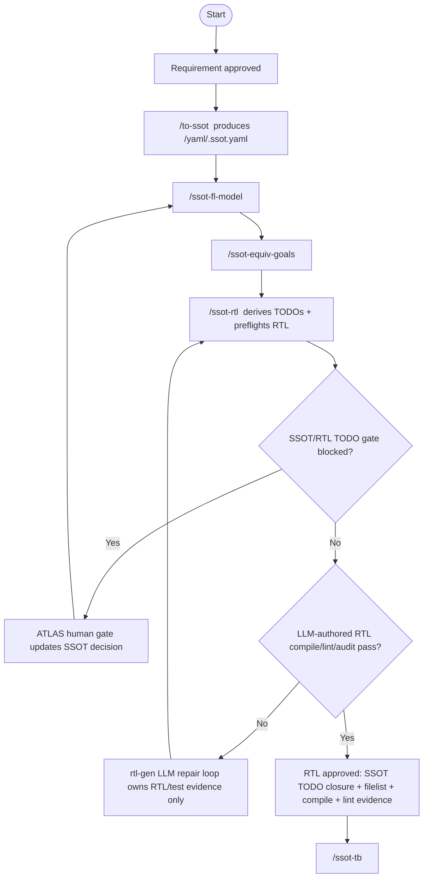

# RTL Generation Workflow

RTL generation is now SSOT/common-engine driven. The old `/new-ip-rtl` and
`/legacy-ip-rtl` command entry points are removed because they bypassed the
single source of truth and duplicated stage logic outside the common engine.

The broader AI-driven IP development model is documented in
[`doc/ai_driven_ip_development_guide.md`](../../doc/ai_driven_ip_development_guide.md).
The approval policy behind `rtl_todo_plan.json` is documented in
[`doc/golden_todo_evidence_flow.md`](../../doc/golden_todo_evidence_flow.md).

## Source Mapping

- Common engine: `src/workflow_stage_engine.py`
- UI-neutral adapter: `src/workflow_stage_surface.py`
- Textual command adapter: `workflow/loader.py`
- ATLAS Web adapter: `src/atlas_ui.py`
- RTL command: `workflow/rtl-gen/commands/ssot-rtl.json`
- RTL TODO derivation: `workflow/rtl-gen/scripts/derive_rtl_todos.py`
- RTL preflight gate: `workflow/rtl-gen/scripts/ssot_to_rtl.py`
- DUT compile report: `workflow/rtl-gen/scripts/rtl_compile_report.py`
- DUT-only lint report: `workflow/lint/scripts/dut_lint_report.py`

## `/ssot-rtl` Internal Contract

`/ssot-rtl <ip>` is a workflow command, not a shell command and not a plain
prompt. It first runs the deterministic SSOT-to-RTL TODO derivation path, then
loads the generated dynamic TodoTracker for the LLM rtl-gen repair loop.

Internal order:

1. `workflow/rtl-gen/commands/ssot-rtl.json` maps `/ssot-rtl` to
   `handler: stage:ssot-rtl`.
2. `src/workflow_stage_engine.py` handles the `ssot-rtl` stage.
3. The stage runs
   `workflow/rtl-gen/scripts/derive_rtl_todos.py <ip> --root <project-root>`.
4. The derive script writes/refreshes:
   - `rtl/rtl_todo_plan.json` in the active IP root
   - `rtl/rtl_todo_tracker.json` in the active IP root
   - `todo/rtl_todo_tracker.json` in the active IP root
5. `workflow/loader.py` loads the dynamic tracker for the existing TodoTracker.
6. `rtl-gen` implements and repairs RTL from the loaded flat TODO ledger.
7. After RTL edits, the stage reruns compile, DUT-only lint, and
   `derive_rtl_todos.py --audit-rtl` until the required gate TODOs close.

The fixed `workflow/rtl-gen/todo_templates/ssot-rtl.json` file is only a seed
surface. The authoritative work breakdown is the derived dynamic tracker, so a
fresh run starts dynamic tracker tasks as `pending`; current audit pass/fail
state is preserved in each task detail/criteria, not pre-approved.

## SSOT Contract Enforcement

RTL-gen is the `SSOT -> RTL` workflow. It must read the current SSOT as the
mandatory reference and translate that contract into RTL. At the start of a run
it should create an internal ledger from:

- `top_module`
- `io_list.interfaces`
- `io_list.clock_domains`
- `sub_modules`
- `filelist.rtl`
- `registers`
- `function_model`
- `cycle_model`
- `fsm`
- timing/synthesis/lint/DFT/quality-gate sections
- `workflow_todos.rtl-gen[]`

Every generated RTL file and every TODO closure must trace back to that ledger.
Existing RTL may be reused only when it already matches the ledger. If the
artifact has missing manifest files, mismatched top ports, stale filelist
entries, or a generic fixture interface such as `valid/data_in/result`, it is
not a downstream-ready RTL result. The correct loop is:

1. Keep SSOT locked.
2. Mark the mismatch as rtl-gen-owned.
3. Repair or rewrite RTL through the rtl-gen workflow.
4. Regenerate `<ip>/list/<ip>.f`.
5. Rerun compile, DUT-only lint, and `derive_rtl_todos.py --audit-rtl`.
6. Continue downstream only after required RTL TODOs pass by evidence.

Route to ssot-gen only when the missing fact is actually absent or
contradictory in SSOT, and cite the exact YAML path in `[SSOT TBD REPORT]`.

See `workflow/COMMON_ENGINE_FLOW.md` for the full req -> SSOT -> FL -> RTL ->
TB -> sim -> sim-debug -> goal-audit flow.
