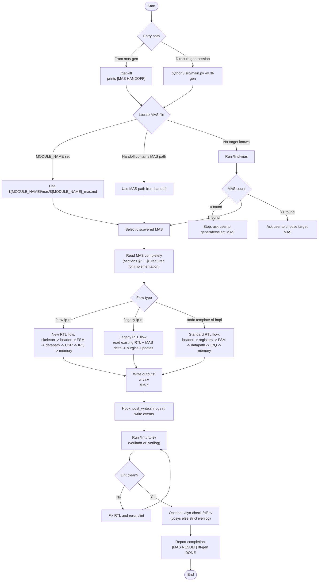

# RTL Generation Workflow (Extracted)

## Source Mapping

- Workflow entry and commands: `workflow/GUIDE.md`, `workflow/mas-gen/commands/gen-rtl.json`
- Handoff contract: `workflow/mas-gen/scripts/handoff_rtl.sh`
- RTL-gen behavior and done criteria: `workflow/rtl-gen/system_prompt.md`
- Task variants: `workflow/rtl-gen/todo_templates/new-ip-rtl.json`, `workflow/rtl-gen/todo_templates/legacy-ip-rtl.json`, `workflow/rtl-gen/todo_templates/rtl-impl.json`
- Validation commands: `workflow/rtl-gen/commands/lint.json`, `workflow/rtl-gen/commands/syn-check.json`
- MAS discovery: `workflow/rtl-gen/commands/find-mas.json`, `workflow/rtl-gen/scripts/find-mas.sh`
- Hook behavior: `workflow/rtl-gen/scripts/hooks.json`, `workflow/rtl-gen/scripts/post_write.sh`
*** End Patch
