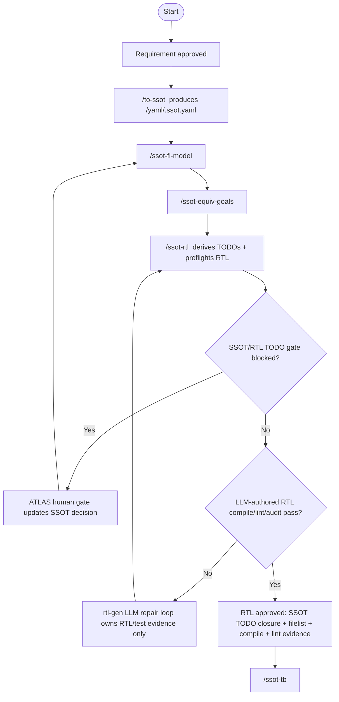

# RTL Generation Workflow

RTL generation is now SSOT/common-engine driven. The old `/new-ip-rtl` and
`/legacy-ip-rtl` command entry points are removed because they bypassed the
single source of truth and duplicated stage logic outside the common engine.

## Source Mapping

- Common engine: `src/workflow_stage_engine.py`
- UI-neutral adapter: `src/workflow_stage_surface.py`
- Textual command adapter: `workflow/loader.py`
- ATLAS Web adapter: `src/atlas_ui.py`
- RTL command: `workflow/rtl-gen/commands/ssot-rtl.json`
- RTL TODO derivation: `workflow/rtl-gen/scripts/derive_rtl_todos.py`
- RTL preflight gate: `workflow/rtl-gen/scripts/ssot_to_rtl.py`
- DUT compile report: `workflow/rtl-gen/scripts/rtl_compile_report.py`
- DUT-only lint report: `workflow/lint/scripts/dut_lint_report.py`

See `workflow/COMMON_ENGINE_FLOW.md` for the full req -> SSOT -> FL -> RTL ->
TB -> sim -> sim-debug -> goal-audit flow.
